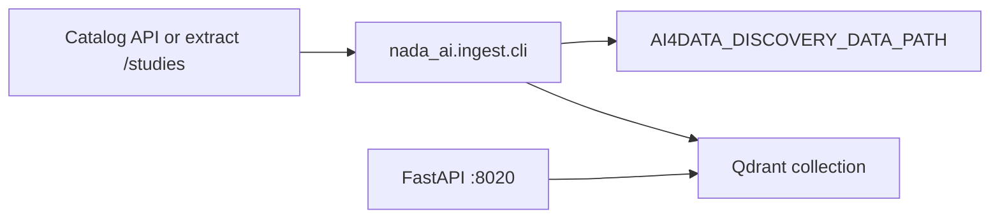

# Qdrant pipeline guide

End-to-end instructions for ingesting NADA catalog metadata into **Qdrant** and searching via the **nada-ai** API. Covers both **running ingest on the host** (Qdrant in Docker) and **running everything in Docker**.

This guide includes the optional **metadata-extract** catalog backend (`search-metadata-extract/studies`), which fetches full metadata in one paginated pass instead of catalog search + per-idno JSON.

---

## What you will run

| Step | Command / service | Purpose |
|------|-------------------|---------|
| 1 | Qdrant | Vector + sparse (BM25) storage |
| 2 | `create_index` | Create the Qdrant collection |
| 3 | `index_from_catalog` | Fetch metadata, embed, upsert points |
| 4 | (optional) `sync-from-ihsn` | Sync dynamic catalog filters into points |
| 5 | API + `POST /search` | Keyword, vector, or hybrid search |



---

## Prerequisites

- **Python 3.11+** and [**uv**](https://docs.astral.sh/uv/) on the host (required for host-side ingest; the Docker image bundles its own venv).
- **Docker** and **Docker Compose** v2.
- Network access to your NADA / IHSN catalog (and credentials if the host requires auth).
- Disk space for:
  - Hugging Face / SentenceTransformer model cache (~1–3 GB depending on model)
  - `./data/nada-discovery` metadata cache
  - Qdrant storage volume

From the **`nada-ai`** repository root:

```bash
cd nada-ai
uv sync --all-groups --extra local --extra qdrant
```

The **`qdrant`** extra installs `qdrant-client` and `fastembed` (sparse BM25). The **`local`** extra installs `sentence-transformers` for dense embeddings.

### ai4data version (metadata-extract)

Catalog extract mode lives in **`ai4data`**. The Docker image and `uv lock` pin a git revision in `pyproject.toml` (`[tool.uv.sources]`).

- **Production / CI:** bump the `rev` after merging extract support into `ai4data`, then run `uv lock && uv sync`.
- **Local development** against a sibling checkout:

  ```toml
  # pyproject.toml — [tool.uv.sources]
  ai4data = { path = "../ai4data", editable = true }
  ```

  Then `uv sync`.

---

## Configuration

Copy the example env file and edit it:

```bash
cp .env.example .env
```

### Minimal `.env` for training IHSN + extract

```env
# --- Search backend ---
NADA_SEARCH_BACKEND=qdrant
NADA_QDRANT_URL=http://localhost:6333
NADA_INDEX_NAME=nada-metadata

# --- Embeddings (local SentenceTransformers) ---
NADA_EMBEDDING_BACKEND=local
NADA_EMBEDDING_MODEL_ID=microsoft/harrier-oss-v1-270m
NADA_QUERY_PROMPT_NAME=web_search_query
# Apple Silicon (host ingest only):
# NADA_EMBEDDING_DEVICE=mps
# Docker compose sets cpu inside the container.

# --- Discovery / catalog (ai4data) ---
AI4DATA_DISCOVERY_DATA_PATH=./data/nada-discovery

AI4DATA_METADATA_CATALOG_URL=https://training.ihsn.org/index.php
AI4DATA_METADATA_CATALOG_EXTRACT_PATH=api/admin/search-metadata-extract

# Auth — set whichever your deployment requires:
AI4DATA_METADATA_CATALOG_X_API_KEY=
# AI4DATA_METADATA_CATALOG_COOKIES=ihsn_nada=...; ccsrf=...
# AI4DATA_METADATA_CATALOG_AUTH_BEARER=

# Optional: allow PDF/download URLs on extra hosts
# AI4DATA_METADATA_CATALOG_X_API_KEY_HOSTS=training.ihsn.org,files.ihsn.org

# --- Optional admin API auth ---
# NADA_ADMIN_API_KEY=dev-secret
```

### Classic catalog (no extract)

Omit **`AI4DATA_METADATA_CATALOG_EXTRACT_PATH`**. Ingest uses the legacy flow:

- `GET /api/catalog/search` → list idnos  
- `GET /api/catalog/json/{idno}` → full metadata per record  

Same CLI commands; more HTTP round-trips on large catalogs.

### URL reference (host vs Docker)

| Variable | Host ingest | Inside `nada-ai-api` container |
|----------|-------------|--------------------------------|
| `NADA_QDRANT_URL` | `http://localhost:6333` | `http://qdrant-nada:6333` (set by compose) |
| `AI4DATA_DISCOVERY_DATA_PATH` | `./data/nada-discovery` | `/workspace/data/nada-discovery` |

Create the cache directory before first ingest:

```bash
mkdir -p data/nada-discovery
```

---

## Option A — Host ingest (Qdrant in Docker)

Use this when you want to run **`uv run python -m nada_ai.ingest.cli ...`** on your machine while Qdrant (and optionally the API) run in containers.

### A1. Start Qdrant only

```bash
docker compose -f docker-compose.qdrant.yml up -d qdrant-nada
```

Verify:

```bash
curl -s http://localhost:6333/ | head
docker logs nada-ai-qdrant-dev 2>&1 | tail -20
```

Qdrant UI / REST: **http://localhost:6333** (ports **6333** HTTP, **6334** gRPC).

### A2. Configure host environment

Ensure `.env` contains (or export):

```bash
export NADA_SEARCH_BACKEND=qdrant
export NADA_QDRANT_URL=http://localhost:6333
export AI4DATA_DISCOVERY_DATA_PATH="$(pwd)/data/nada-discovery"
```

`uv run` loads `.env` automatically via pydantic-settings / dotenv when present.

### A3. Create the collection

```bash
uv run python -m nada_ai.ingest.cli create_index
```

Recreate from scratch (drops existing collection):

```bash
uv run python -m nada_ai.ingest.cli create_index --recreate=True
```

### A4. Ingest from catalog

Smoke test (first 10 records):

```bash
uv run python -m nada_ai.ingest.cli index_from_catalog \
  --catalog_type=document \
  --limit=10
```

Full catalog (documents example):

```bash
uv run python -m nada_ai.ingest.cli index_from_catalog \
  --catalog_type=document \
  --ps=100
```

**Catalog type values**

| `--catalog_type` | Content |
|------------------|---------|
| `document` | Documents |
| `timeseries` or `indicator` | Indicators |
| `survey` or `microdata` | Microdata |
| `geospatial` | Geospatial |

With **`AI4DATA_METADATA_CATALOG_EXTRACT_PATH`** set, `index_from_catalog` paginates **`/studies`** once and warms the metadata cache during ingest (no N+1 JSON fetches).

Other useful flags:

```bash
# Re-fetch metadata even if cached
uv run python -m nada_ai.ingest.cli index_from_catalog --catalog_type=document --force=True

# Drop and recreate collection before ingest
uv run python -m nada_ai.ingest.cli index_from_catalog --catalog_type=document --recreate_index=True
```

### A5. (Optional) Pre-cache metadata without indexing

Two-step workflow using **ai4data** batch scrape only:

```bash
cd ../ai4data   # or use uv run from nada-ai if ai4data is installed
uv run python -m ai4data.discovery.catalog.batch scrape_all_metadata \
  type=document ps=100
```

Then run `index_from_catalog` as above; cached JSON under `data/nada-discovery/metadata_cache/` is reused.

### A6. (Optional) Sync dynamic filters

After ingest, sync IHSN filter facets (see also [dynamic-filters.md](./dynamic-filters.md)):

```bash
uv run python -m nada_ai.filters.cli ensure-indexes
uv run python -m nada_ai.filters.cli sync-from-ihsn --all --page-size=100
```

Filter auth can use `NADA_IHSN_*` variables or the same `AI4DATA_METADATA_CATALOG_*` credentials when extract path is configured.

### A7. Start the search API (host)

```bash
uv run uvicorn nada_ai.app.main:app --host 0.0.0.0 --port 8020
```

Warm up embeddings (avoids a slow first search):

```bash
curl -s http://localhost:8020/health
curl -s http://localhost:8020/health/embeddings
curl -s -X POST http://localhost:8020/health/embeddings/warmup
```

Search:

```bash
curl -s -X POST http://localhost:8020/search \
  -H 'Content-Type: application/json' \
  -d '{
    "query": "consumer price index",
    "mode": "hybrid",
    "filters": {"type": "document"},
    "size": 5
  }' | python -m json.tool
```

Browser UI: **http://localhost:8020/demo**

---

## Option B — Full Docker (Qdrant + API)

Use this when both Qdrant and the FastAPI service should run in Compose, and you prefer **`docker exec`** for ingest.

### B1. Prepare

```bash
mkdir -p data/nada-discovery
cp .env.example .env   # edit catalog URL, extract path, API keys
```

Compose loads **`.env`** via `env_file` on both services. Uncomment or add catalog variables in `.env` (see [Configuration](#configuration)).

### B2. Build and start

```bash
docker compose -f docker-compose.qdrant.yml up --build -d
```

Check status:

```bash
docker compose -f docker-compose.qdrant.yml ps
docker logs nada-ai-qdrant-dev 2>&1 | tail -20
docker logs nada-ai-api-qdrant-dev 2>&1 | tail -30
```

Endpoints:

- Qdrant: **http://localhost:6333**
- API: **http://localhost:8020**

Compose already sets `NADA_SEARCH_BACKEND=qdrant`, `NADA_QDRANT_URL=http://qdrant-nada:6333`, and `AI4DATA_DISCOVERY_DATA_PATH=/workspace/data/nada-discovery`.

### B3. Dev overlay (edit Python without rebuild)

Bind-mount `src/` and enable uvicorn reload:

```bash
docker compose -f docker-compose.qdrant.yml -f docker-compose.dev.yml up --build -d
```

Rebuild the image when `Dockerfile`, `pyproject.toml`, or `uv.lock` change—not for everyday edits under `src/`.

### B4. Create collection (inside container)

```bash
docker exec nada-ai-api-qdrant-dev \
  python -m nada_ai.ingest.cli create_index
```

Recreate:

```bash
docker exec nada-ai-api-qdrant-dev \
  python -m nada_ai.ingest.cli create_index --recreate=True
```

### B5. Ingest from catalog (inside container)

Smoke test:

```bash
docker exec nada-ai-api-qdrant-dev \
  python -m nada_ai.ingest.cli index_from_catalog \
  --catalog_type=document --limit=10
```

Full run:

```bash
docker exec -it nada-ai-api-qdrant-dev \
  python -m nada_ai.ingest.cli index_from_catalog \
  --catalog_type=document --ps=100
```

Metadata cache is written to **`./data/nada-discovery`** on the host (bind-mounted).

### B6. Warmup and search

```bash
docker exec nada-ai-api-qdrant-dev curl -s http://127.0.0.1:8020/health
docker exec nada-ai-api-qdrant-dev curl -s -X POST http://127.0.0.1:8020/health/embeddings/warmup

curl -s -X POST http://localhost:8020/search \
  -H 'Content-Type: application/json' \
  -d '{"query":"poverty","mode":"hybrid","size":5}' | python -m json.tool
```

### B7. Ingest via HTTP (non-blocking)

When the API container is up:

```bash
# Optional admin auth
export NADA_ADMIN_API_KEY=dev-secret
H=(-H "X-NADA-Admin-Key: $NADA_ADMIN_API_KEY")

curl -s "${H[@]}" -X POST http://localhost:8020/admin/index \
  -H 'Content-Type: application/json' -d '{"recreate": false}'

curl -s "${H[@]}" -X POST http://localhost:8020/admin/ingest/from-catalog \
  -H 'Content-Type: application/json' \
  -d '{"catalog_type": "document", "limit": 50}'

# Poll job status (job id from 202 response)
curl -s http://localhost:8020/jobs/<job_id>
```

See the main [README](../README.md#admin--ingest-endpoints-http) for the full admin API table.

### B8. Stop / reset

```bash
# Stop containers (keep Qdrant volume)
docker compose -f docker-compose.qdrant.yml down

# Stop and delete Qdrant data volume (wipes vectors)
docker compose -f docker-compose.qdrant.yml down -v
```

---

## Verification checklist

Run through this after ingest to confirm the pipeline succeeded.

1. **Qdrant is up**

   ```bash
   curl -s http://localhost:6333/collections
   ```

2. **Collection exists** — name defaults to `NADA_INDEX_NAME` (`nada-metadata`):

   ```bash
   curl -s http://localhost:6333/collections/nada-metadata | python -m json.tool
   ```

   `result.points_count` should be &gt; 0 after ingest.

3. **Discovery cache populated**

   ```bash
   ls data/nada-discovery/metadata_cache/document/ | head
   ls data/nada-discovery/metadata_ids/
   ```

4. **API health**

   ```bash
   curl -s http://localhost:8020/health
   curl -s http://localhost:8020/health/embeddings
   ```

5. **Search returns hits**

   ```bash
   curl -s -X POST http://localhost:8020/search \
     -H 'Content-Type: application/json' \
     -d '{"query":"test","mode":"keyword","size":3}'
   ```

6. **(Optional) Inspect one idno**

   ```bash
   curl -s "http://localhost:8020/admin/docs/YOUR_IDNO" \
     -H "X-NADA-Admin-Key: $NADA_ADMIN_API_KEY"
   ```

   Omit the admin header if `NADA_ADMIN_API_KEY` is unset.

---

## Troubleshooting

| Symptom | Likely cause | Fix |
|---------|--------------|-----|
| `ACCESS-DENIED` from catalog | Missing or wrong API key / cookie / bearer | Set `AI4DATA_METADATA_CATALOG_X_API_KEY`, `COOKIES`, or `AUTH_BEARER` in `.env` |
| `Study missing metadata payload` | Extract called without full metadata | Ensure `AI4DATA_METADATA_CATALOG_EXTRACT_INCLUDE_METADATA=true` (default) |
| `Connection refused` to Qdrant (host ingest) | Wrong URL | Use `http://localhost:6333` on host, not `qdrant-nada` |
| `Connection refused` inside API container | Qdrant not running | `docker compose -f docker-compose.qdrant.yml up -d qdrant-nada` |
| Empty search results | Collection empty or embeddings not warmed | Re-run ingest; call `/health/embeddings/warmup` |
| Dimension mismatch errors | Model changed after ingest | `create_index --recreate=True` and re-ingest with the same `NADA_EMBEDDING_MODEL_ID` |
| Sparse / hybrid errors after upgrade | Old dense-only collection | `create_index --recreate=True` or set `NADA_QDRANT_SPARSE_LEXICAL=false` until reindexed |
| Extract mode not used | Old ai4data pin | Bump `[tool.uv.sources]` rev or use local `path` dependency |
| Slow first search | Model load | `POST /health/embeddings/warmup` |

**Logs**

```bash
docker logs nada-ai-api-qdrant-dev 2>&1 | tail -100
docker logs nada-ai-qdrant-dev 2>&1 | tail -50
```

**Re-ingest one idno**

```bash
uv run python -m nada_ai.ingest.cli index \
  --idnos=RWA_NISR_DOC_2025_CPI-MR_MAY_FR_V1 \
  --metadata_type=document \
  --force=True
```

---

## Quick reference

### Host — full pipeline

```bash
cd nada-ai
cp .env.example .env    # edit catalog + auth
mkdir -p data/nada-discovery
uv sync --extra local --extra qdrant

docker compose -f docker-compose.qdrant.yml up -d qdrant-nada

uv run python -m nada_ai.ingest.cli create_index
uv run python -m nada_ai.ingest.cli index_from_catalog --catalog_type=document --limit=10

uv run uvicorn nada_ai.app.main:app --host 0.0.0.0 --port 8020
curl -s -X POST http://localhost:8020/health/embeddings/warmup
```

### Docker — full pipeline

```bash
cd nada-ai
cp .env.example .env
mkdir -p data/nada-discovery

docker compose -f docker-compose.qdrant.yml up --build -d

docker exec nada-ai-api-qdrant-dev python -m nada_ai.ingest.cli create_index
docker exec nada-ai-api-qdrant-dev \
  python -m nada_ai.ingest.cli index_from_catalog --catalog_type=document --limit=10

curl -s -X POST http://localhost:8020/health/embeddings/warmup
open http://localhost:8020/demo
```

---

## Related docs

- [README](../README.md) — package overview, CLI, admin HTTP API  
- [dynamic-filters.md](./dynamic-filters.md) — filter sync and facet search  
- [ai4data discovery README](https://github.com/avsolatorio/ai4data/blob/main/src/ai4data/discovery/README.md) — catalog env vars and batch scrape  
